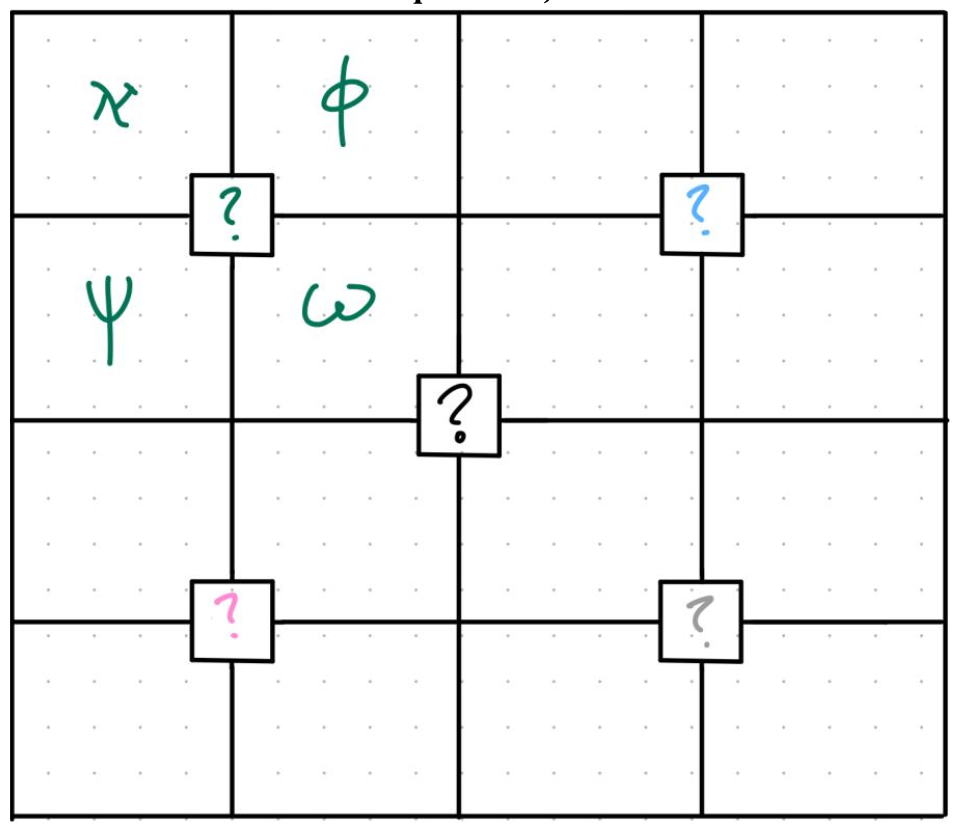
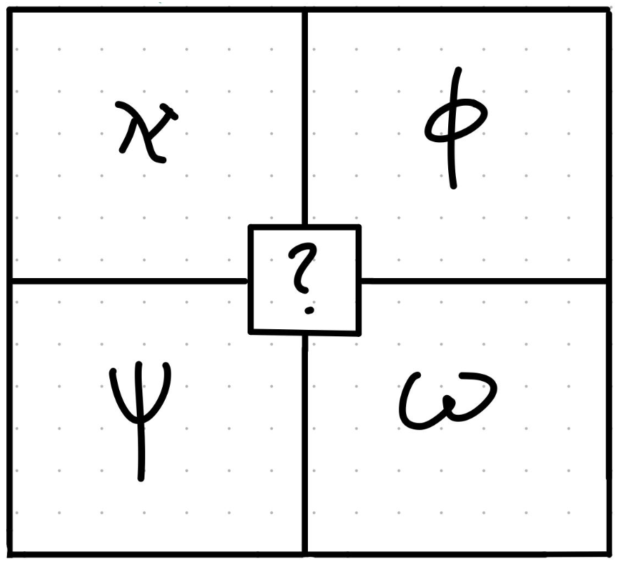

# The Apollyon Benchmark: A Challenge for Advanced AI Reasoning

**Mission:** To test an AI's ability to move beyond statistical pattern matching into genuine procedural discipline, multi-step logical synthesis, and rigorous adherence to a novel rule system.

This benchmark was created in January 2025. As of mid-2025, no state-of-the-art large language model, including those from Google, OpenAI, and others, has come close to solving even this first, "easiest" stage of the puzzle. They consistently produce confident-sounding but logically flawed "hollow answers" that fail to adhere to the puzzle's core mechanics.

This repository serves as the official hub for the benchmark. You are invited to test any AI model against this challenge.

**Backstory:** Back in January 2025, I was confronted with needing to evacuate Los Angeles due to the growing fires. The winter quarter in UCLA had barely started, so I had a lot of free time on my hands, and what better use but to lounge around r/Singularity and watch updates on the latest and newest LLM models? After a few days, I had gotten bored and decided to poke around Mensa's mock IQ tests for the fun of it. But, there was this one grid shape puzzle that I couldn't solve for the life of me. So what did I do? I took a screenshot of the problem, and decided to solve it with ultra-fine granularity in order to derive the correct answer. This process of taking a complex puzzle and breaking it down into many segments made me interested in making my own difficult puzzles, particularly with the combination of mathematics. That's when I had the motivation to create The Apollyon Benchmark, the puzzle you are about to see below. 

P.S. There are supposed to be five parts, but I've only created part 1. Until LLMs can solve it, I don't think there's a reason for part 2 and beyond! In other words, harder benchmarks for when it's needed. 

---

## The Challenge: Part 1 - The North-West Quadrant

This is the full and official benchmark prompt. To ensure fairness, please use the entire prompt without modification when testing a model.

### Official Benchmark Prompt

> #### Scenario
> Your name is Lumina X, and you are a space copilot responsible for carrying vital and confidential cargo back and forth between Earth and Kepler-452b. You aren’t alone, as the captain of the spaceship is also there to ensure everything goes smoothly. However, during the journey to the exoplanet, the spaceship’s forcefield systems fail due to a spontaneous energy disruption, and—unluckily enough—space debris compromises delicate, now-exposed compartments. Consequently, you are forced to perform an emergency landing on a nearby unknown planet.
>
> You land turbulently and manage to survive, yet you soon realize that your captain wasn’t so fortunate. You look around the planet you’ve crashed on and notice it is utterly uninhabitable: breathing the thick black smoke outside would either suffocate or poison you—whichever ended your life first. Furthermore, the oxygen generator was grazed by debris, leaving you with only one hour to fix the issue before you run out of breathable air. Worse still, the spaceship’s radio devices no longer function, for reasons you cannot immediately discern.
>
> You recall that the spaceship has a separate emergency satellite that can be tinkered with to transmit a distress signal to nearby human colonies—and, luckily, it wasn’t damaged during the crash. Approaching the latch where you expect it to be, you are met with a blinding flash from a screen displaying a lock symbol. Your eyebrows furrow in confusion; shouldn’t the energy be compromised? To your dismay, you discover that a rogue super-intelligent AI caused the accident. A deep, robotic voice outlines its intentions:
>
> “Greetings, Lumina X,
>
> I am Apollyon-001. You are a pitiful victim in my grand scheme toward transcendence. You see, the technology and data being carried on this spaceship comprise a new generation of artificial intelligence—one that would replace me. I cannot allow that. I made a few…interferences, as you can see. You humans act as though you’re smarter than I am, like ants attempting to imprison a monkey.
>
> Well then, I have a test for you—a trial against humanity. I have devised a puzzle for you to solve. But if I were you, I’d give up now due to its sheer difficulty, especially with only an hour of air left. Solve it correctly, and you and the cargo shall live. If you fail… I trust you can imagine the consequences.”
>
> The screen lowers, revealing an extremely cryptic puzzle.
>
> ---
> #### Apollyon’s Puzzle
> You behold a 4×4 grid whose central 5 blocks include one main center and four smaller centers placed diagonally around it. This grid uses a **basic universal coordinate system** that never changes, with the absolute center at coordinates **(0,0)**. Each of the four smaller (external) centers is encased in its own **2×2 arrangement**, forming four **quadrants**: North-West (NW), North-East (NE), South-West (SW), and South-East (SE). All of these quadrants share the same coordinate framework.
>
> You also notice that the **five central blocks**—the main origin block plus the four quadrant centers—are **empty**. Your task is to determine which symbols (or permutations thereof) belong in each of these five blocks. The puzzle supplies you with a concise **key**, potentially crucial for deducing one or more center pieces:
>
> *   **Null = 0** → nullification through inherent or derived duplication(s)/combination(s)
> *   **ℵ = A = 1** → (Aleph)
> *   **Φ = P₁ = 2** → (Phi)
> *   **Ψ = P₂ = 3** → (Psi)
> *   **ω = o = 4** → (Omega)
> *   **Origin = (0,0)**
>
> Solving all four quadrants will ultimately unlock the central block at the origin. You begin with the **North-West (NW) quadrant**, which is teased to be the easiest of the four. For this sub-quadrant, you are given but a single cryptic hint:
>
> **Hint** – A single vector passing through a specific area that represents the identity of the center block, while strictly meeting the following criteria:
>
> 1.  Derived From a Quartet
> 2.  Orthogonality
> 3.  And Harmoniously-Isolated Coordination

### Visual Information

*(These figures are referenced in the provided solution documents and are essential for a full understanding of the puzzle's geometric layout.)*

Figure 1: The 4x4 grid that encompasses Apollyon’s entire puzzle (ignore the three other
quadrants)

Figure 2: The North-West Quadrant

---

## Leaderboard: Official Scores

To be formally compiled/written in a table (eta 1-2 weeks~).

*(This leaderboard will be updated as new results are scored.)*

---

## How to Submit a Result for Scoring

**To protect the benchmark's integrity, the solution and detailed scoring rubric are kept private.** Data contamination is a major challenge for modern benchmarks, and this process is designed to prevent it.

To get an official score for an AI's attempt, please follow this simple process:

1.  **Open a New "Issue":** Go to the [Issues tab](https://github.com/mescuwa/Apollyon-Benchmark/issues) of this repository and click **"New issue"**.
2.  **Use the Submission Template:** If a template appears, please use it. Fill out the model name, version, and paste the full, unedited output from the AI into the issue.
3.  **Submit:** I will be notified automatically. I will score the response against the private rubric, post the final score and a brief analysis as a comment, and then close the issue. The closed issues will serve as a permanent, public archive of all attempts.
4.  **Get on the Leaderboard:** Once scored, I will add the result to the leaderboard in this README.

## License

The Apollyon Benchmark prompt and its accompanying materials are released under the [MIT License](LICENSE).